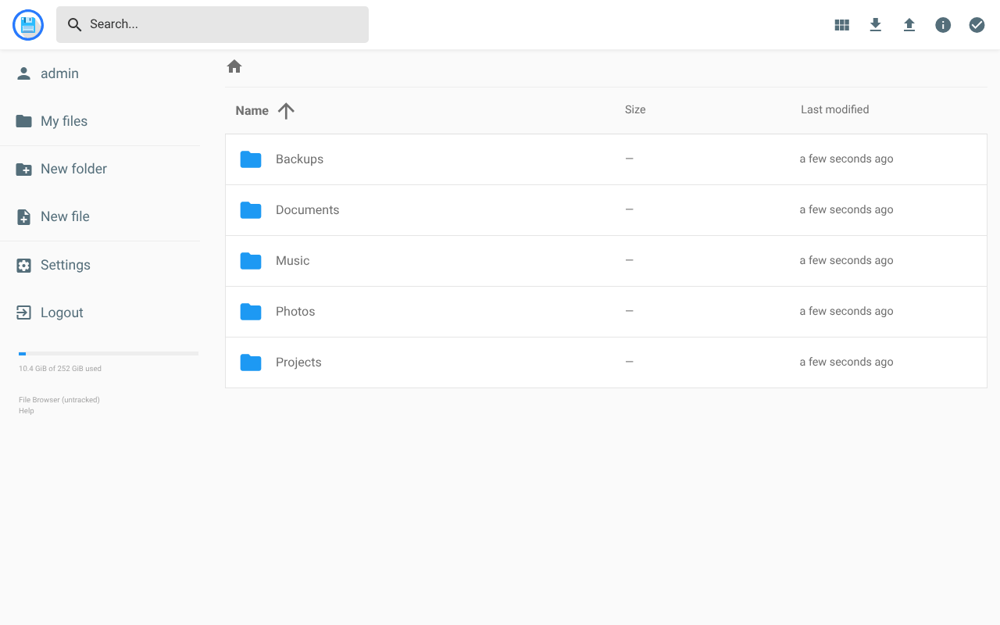
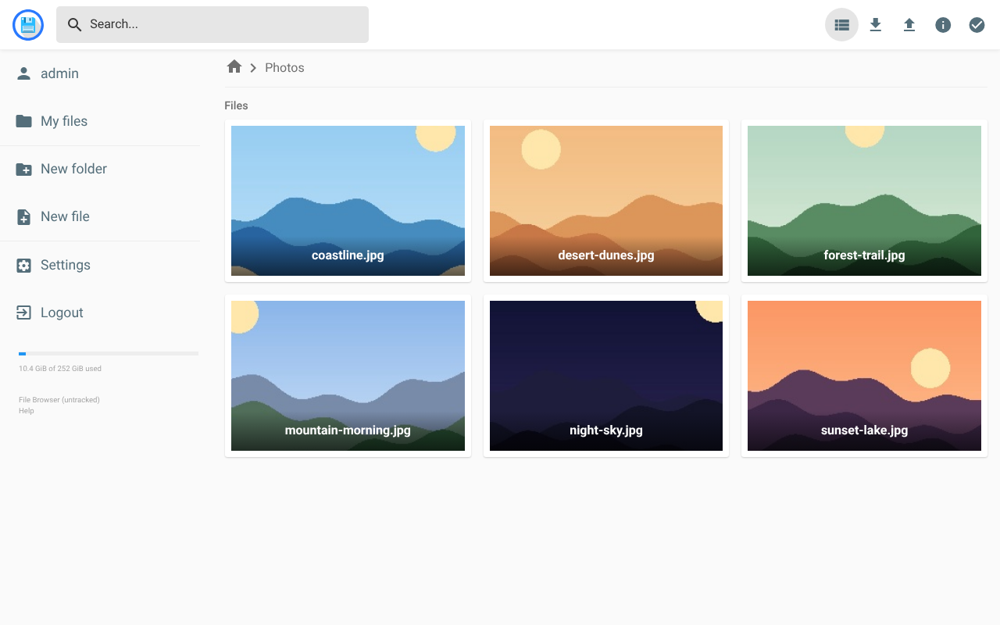
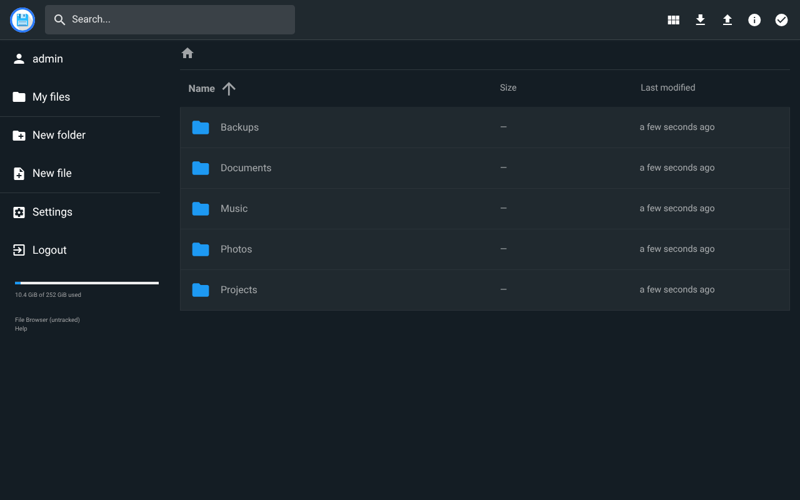
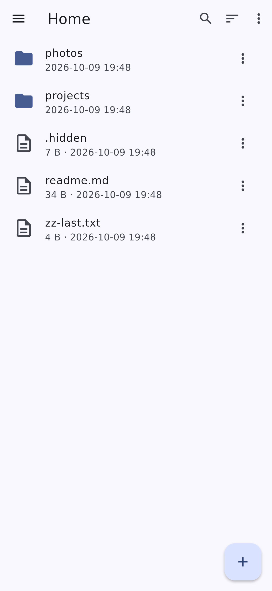
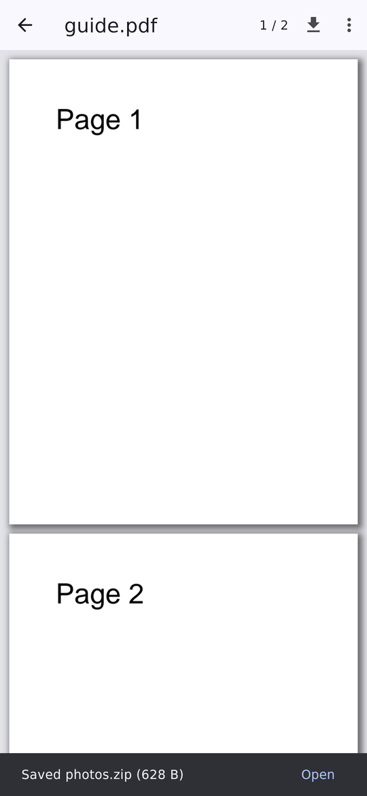
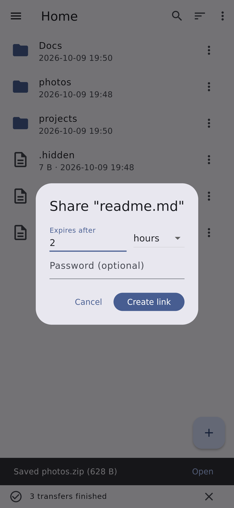
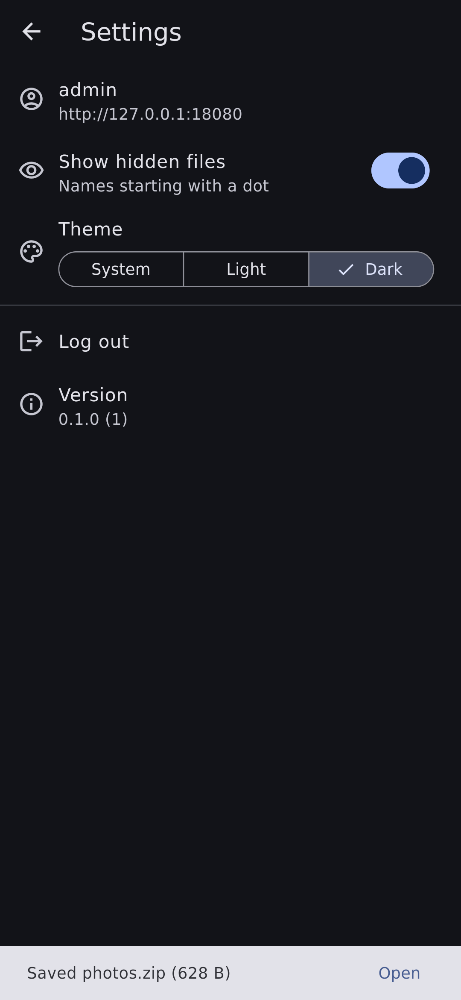

> [!NOTE]
>
> **This is a personal fork, maintained by [Paul Buetow](https://github.com/snonux).** Upstream
> [File Browser](https://github.com/filebrowser/filebrowser) was archived on 2026-09-01 and receives no
> further releases or fixes. I keep it going here for my own use: it carries security fixes made after
> the archive and a native Android client. I haven't bothered renaming it yet, so it is still called
> File Browser everywhere; that may change later.

  

File Browser provides a file managing interface within a specified directory and it can be used to upload, delete, preview and edit your files. It is a **create-your-own-cloud**-kind of software where you can just install it on your server, direct it to a path and access your files through a nice web interface.

**Background on the upstream archive:** [Goodbye File Browser, for Real This Time](https://hacdias.com/2026/07/28/filebrowser/), July 2026.

## What this fork adds

- **Security fixes after the archive.** Ten server fixes and a frontend dependency update, listed under [Security](#security).
- **A native Android client** in [`filebrowser-android/`](filebrowser-android), installable through F-Droid. See [Android client](#android-client).

## Screenshots

### Web interface

| File listing | Photo gallery |
| --- | --- |
|  |  |
| **Image preview** | **Dark theme** |
|  |  |

### Android app

| Browsing | Image viewer | PDF viewer | Share link | Settings |
| --- | --- | --- | --- | --- |
|  |  |  |  |  |

## Android client

[`filebrowser-android/`](filebrowser-android) is a Flutter app (`org.buetow.filebrowser`) that talks to the
server's existing REST API, so it works with an unmodified File Browser server. It browses, previews images,
PDFs, video and audio, edits text files, uploads (resumable, via tus), downloads, manages files, searches,
and creates share links with the web UI's options. Its [README](filebrowser-android/README.md) has the full
feature list and build instructions.

Install it from my F-Droid repository, which also delivers updates:
[snonux/fdroid](https://github.com/snonux/fdroid) (repository address `https://snonux.github.io/fdroid/repo`).
App releases are tagged `android-vX.Y.Z`; the server keeps the `vX.Y.Z` tags.

## Security

The fixes below landed in this fork after the upstream archive (last upstream release: v2.63.23). They are
on `master`; no server release or Docker image has been cut from this fork yet, so build from source
(see [CONTRIBUTING.md](CONTRIBUTING.md)) to get them. Where a fix answers a report filed against upstream,
the report's GHSA id is given.

- **Command WebSocket read before the permission check.** `/api/command` buffered an unbounded message from any authenticated user, even with command execution disabled. It now checks permission first and caps messages at 64 KiB. (`GHSA-39cx-23x9-5c8p`)
- **Unbounded subtitle conversion.** Converting `.srt`/`.ass`/`.ssa` files to WebVTT loaded them fully into memory; files over 10 MB are now refused. (`GHSA-448h-jr2h-3vhp`)
- **Upload failure deleted directories.** An upload aimed at an existing directory failed and its cleanup ran `RemoveAll` on that tree, bypassing delete permission and rules. Uploads over directories are now rejected and the cleanup removes only the single file. (`GHSA-c4fr-5f24-4wrj`)
- **Path rules bypassed through symlinks.** Rules were matched on the requested name only, so a symlink to a rule-denied file in the same scope gave read and write access to it. Rules now apply to the resolved target too. (`GHSA-7w29-q235-57m9`)
- **Named pipes hung requests.** Archiving, public shares and type detection could open a FIFO and block forever, including for anonymous share visitors. Only regular files and directories are opened now. (`GHSA-8q5j-8wcr-8v2v`)
- **Stale shares after delete.** Deleting a file another user had shared left that share in place, so the old public link served whatever was later created at the path. All shares of the deleted file are now removed. (`GHSA-r6pg-pg54-rcr5`)
- **Stale shares after rename.** The same problem on rename: the old link, with its password and expiry, kept serving the old name. Shares of the old path are now removed. (`GHSA-m8v4-4w34-rrvf`)
- **Concurrent TUS chunks.** Parallel PATCHes at the same offset all appended, so an upload could exceed its declared length. One chunk per upload is admitted at a time. (`GHSA-4r8p-gqj2-mwgm`)
- **Rules not checked on a recursive listing's root.** A rule-denied directory answered as an empty listing instead of being refused.
- **Clickjacking.** No response forbade cross-origin framing; every response now sends `X-Frame-Options: SAMEORIGIN`.
- **Vulnerable frontend dependencies.** `dompurify` and the transitive `@xmldom/xmldom`, `lodash`, `nanoid` and `postcss` were updated to patched versions.

Reporting instructions are in [SECURITY.md](SECURITY.md). Two known issue classes remain unaddressed:

- **Command execution, runner, and hooks.** This feature is plagued with vulnerabilities across many published advisories, and would need a full rewrite to be made safe. It is disabled by default; if you re-enable it with `--disable-exec=false`, treat the ability to run commands as equivalent to shell access on the host. Background: [#5199](https://github.com/filebrowser/filebrowser/issues/5199).
- **Session and JWT handling.** Sessions are self-contained JWTs rather than server-side identifiers, so they cannot be revoked, which means that logout, password changes, and renewal leave previously issued tokens valid until they expire, and the same refresh token can be redeemed repeatedly. Assume a leaked token is valid until expiry. Background: [#5216](https://github.com/filebrowser/filebrowser/issues/5216).

This is a one-person fork, so run it defensively:

- **Do not expose it directly to the internet.** Put it behind a reverse proxy that terminates TLS and performs its own authentication.
- **Keep the command runner disabled.** It is off by default, so leave it off. See [#5199](https://github.com/filebrowser/filebrowser/issues/5199) and [`docs/command-execution.md`](docs/command-execution.md).
- **Run it unprivileged, inside a container**, with only the directory you intend to serve mounted into it.

Upstream's published advisories are listed under [security advisories](https://github.com/filebrowser/filebrowser/security/advisories).

## Documentation

Documentation on how to install, configure, and build this project lives in [`docs`](docs) in this repository.

[CONTRIBUTING.md](CONTRIBUTING.md) documents how to build and develop the project.

## License

[Apache License 2.0](LICENSE) © File Browser Contributors
